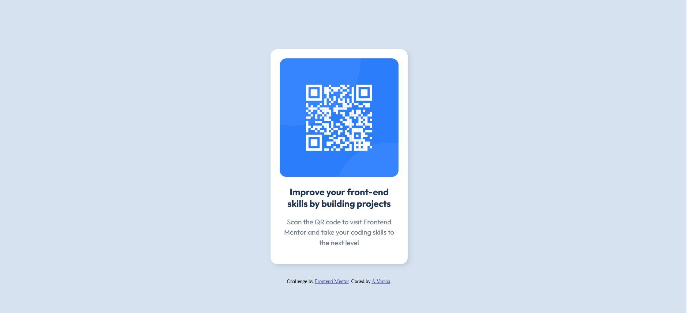

# Frontend Mentor - QR code component solution

This is a solution to the [QR code component challenge on Frontend Mentor](https://www.frontendmentor.io/challenges/qr-code-component-iux_sIO_H). Frontend Mentor challenges help you improve your coding skills by building realistic projects. 

## Table of contents

- [Overview](#overview)
  - [Screenshot](#screenshot)
  - [Links](#links)
- [My process](#my-process)
  - [Built with](#built-with)
  - [What I learned](#what-i-learned)
  - [Continued development](#continued-development)
- [Author](#author)

**Note: Delete this note and update the table of contents based on what sections you keep.**

## Overview

### Screenshot



### Links

- Solution URL: (https://github.com/Varsha-A03/QR-Code-Project)
- Live Site URL: (http://127.0.0.1:5500/index.html)

## My process

### Built with

- Semantic HTML5 markup
- CSS custom properties
- Flexbox
- CSS Grid
- Mobile-first workflow

### What I learned

While building this challenge, I gained a better understanding of several fundamental concepts that improved my workflow and code quality.

1. Linking google fonts:
I learned how to incorporate custom fonts using google fonts. By adding a <link> in the html <head> section, I was able to apply a specific font across my code. This technique allowed me to easily style the text with the desired font, adding a professional look to the design.

2. Universal Selector and box-sizing in CSS:
Using the universal selector(*) in CSS to reset margin and padding on all elements to zero made a big difference in achieving consistent spacing.Additionally, setting box-sizing :border-box; helped manage sizing of elements more effectively, as it includes padding and border within the element's specified width and height. This approach made layout adjustments more intuitive and reduced unexpected layout shifts.
```html linking
<link rel="preconnect" href="https://fonts.googleapis.com">
<link rel="preconnect" href="https://fonts.gstatic.com" crossorigin>
<link href="https://fonts.googleapis.com/css2?family=Outfit:wght@100..900&display=swap" rel="stylesheet">
```
```css 
* {
      margin:0;
      padding:0;
      box-sizing:border-box;
    }
```

### Continued development

In future projects, I plan to focus more on understanding and practicing the font-size attributes, particularly with different units and dimensions. I've found that chossing the right unit(such as px, em, rem, %, etc.)can significantly impact the responsiveness and readability of a design. With more practice, I aim to become more confident in selecting and applying font sizes effectively to create scalable, accesible layouts.

## Author

- Frontend Mentor - [Varsha-A03](https://www.frontendmentor.io/profile/Varsha-A03)


